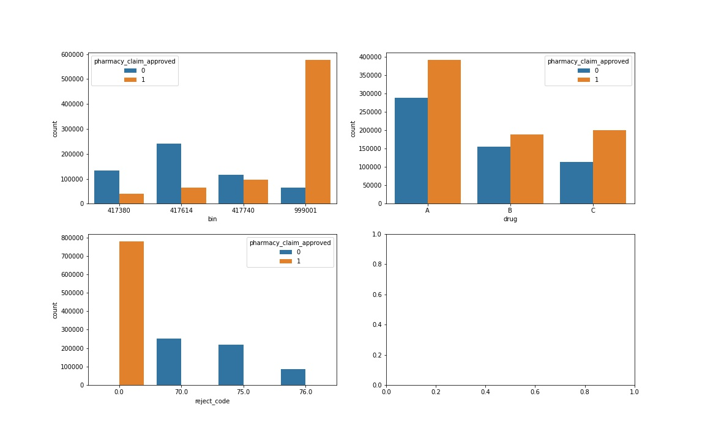
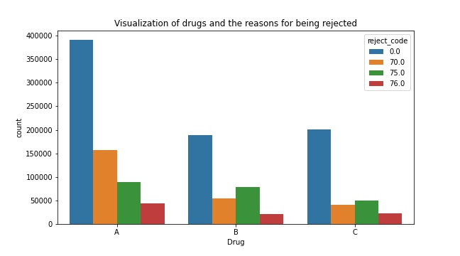
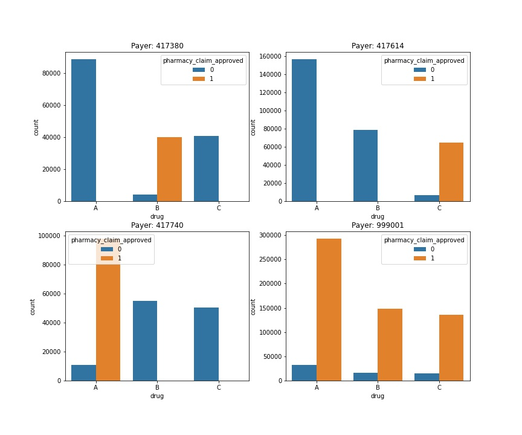
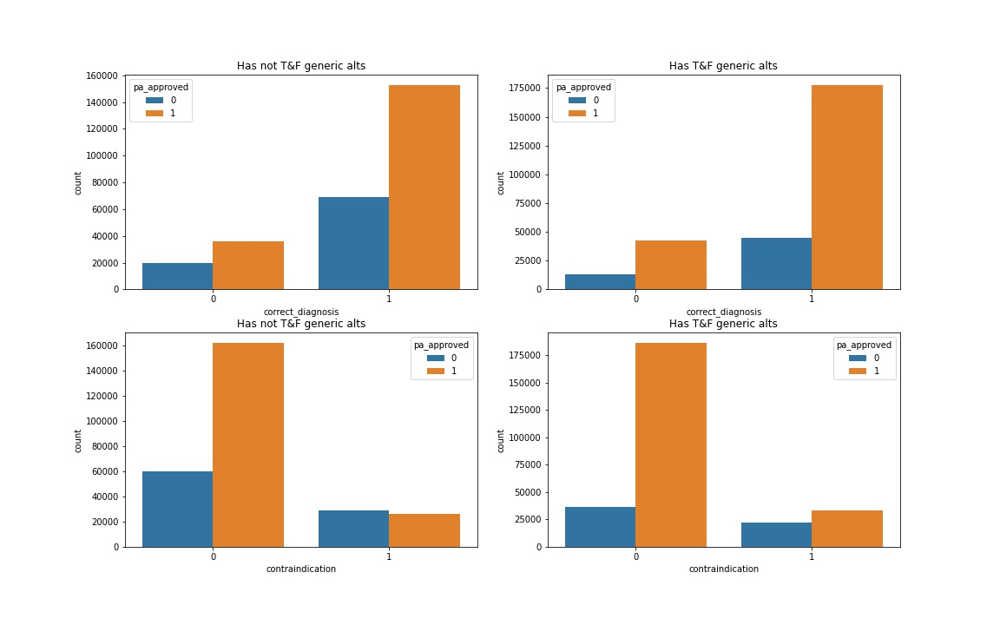

# CoverMyMeds Project: 

## Project Overview 
* Two part project in which I created two models to make predictions based on prior authorization information. 

* Part 1 of the project consisted of creating a model predicting whether a prior authorization would be needed based upon pharmacy claims data. This portion of the prject also consisted of exploratory data analysis in which the following questions were answered: 

  * Which insurance companies had the most approved pharmacy claims? 
  * Which drug was approved the most (numerically)? Which rejection code seemed to appear the most with each drug? 
  * What about a scaled version of this? Relatively, how much did each code appear for each drug?

* Part 2 of the project consisted of creating a model predicting whether a prior authorization is likely to be approved. This model was based on data contained on the PA such as correct diagnosis, has already tried and failed a generic drug alternative, has health-related reasons not to take certain medications (contraindications), and claims data. Moreover, this portion consisted of exploratory data analysis in which the following questions were answered (based only on the prior authorization data): 

  * What is the relationship between the correct diagnosis, tried and failed, and contraindication and the prior authorization being approved? 
  * Of the people who have or have not tried and failed a generic alternative, how many of them had contraindications or a correct diagnosis? 

## Code and Resources Used 
**Python Version:** 3.9  
**Packages:** pandas, numpy, sklearn, matplotlib, seaborn,    
**Books Used**: 
- Grus, Joel. Data science from scratch: first principles with python. O'Reilly Media, 2019.
- Bruce, Peter, Andrew Bruce, and Peter Gedeck. Practical Statistics for Data Scientists: 50+ Essential Concepts Using R and Python. O'Reilly Media, 2020.
- McKinney, Wes. Python for data analysis: Data wrangling with Pandas, NumPy, and IPython. " O'Reilly Media, Inc.", 2012.

URLs used: 
- https://www.analyticsvidhya.com/blog/2020/03/one-hot-encoding-vs-label-encoding-using-scikit-learn/
-https://towardsdatascience.com/accuracy-precision-recall-or-f1-331fb37c5cb9
- https://github.com/adam-p/markdown-here/wiki/Markdown-Cheatsheet

## Data Cleaning
There was only a small amount of data cleaning necessary for this project. In particular, for part 1, there was missing data in the reject_code column of the dim_claims_df data frame. I chose to replace the missing data with 0 using the fillna method from pandas. I chose to use zero because no reject_code meant that your pharmacy claim got approved. 

## EDA
I looked at the distributions of the data and the value counts for the various categorical variables. Below are a few highlights and pictures of graphs can be found in the compressed file folder (see documentation above). 

**Part 1**:

* Count plot showing the how many times a insurance provider approved or denied the pharmacy claim. The count plot also shows how many times (total) each drug was approved or denied a pharmacy claim. 

* Count plot visualization detailing each drug and the associated times that a reject code appeared with said drug. 

* Count plot detailing the formulary for each insurance provider and the number of times each drug was approved or not. 

**Part 2**: 
* Count plot detailing which factors influenced pas being approved or denied. 

## Model Building 

**Part 1**: 
First, I transformed the categorical variables into dummy variables using a one hot encoder. I also split the data into train and tests sets with a test size of 30%.   

I used a random forest classifier for the moodel and evaluated the model using the accuracy, precision, recall, and AUC metrics. I chose a random forest classifier because of the sparsity associated with the data as well as the primary binary nature of each feature. 

A GridSearchCV was performed on the random forest model where I analyzed the max_depth hyperparameter. The GridSearchCV returned that the random forest classifier with a max_depth hyperparameter equal to 5 performed more optimally on the precision metric. I consequentely used this model for the prediction. 

**Part 2**: 
In order to create the appropriate feature matrix for the testing models, I first had to use the given bridge table to combine information from the claims data as well as prior authorization data. This was done using pandas. 

I also split the data into train and tests sets with a test size of 30%. Each predicting feature was already numerical and in binary values. 

I tried three different models and again evaluated them using accuracy, precision, recall, and AUC for the same reason above. 

Models Used: 
*	**DecisionTreeClassifier** – Baseline for the model
*	**KNN** – To see how data performed on another non ensemble model. 
*	**Random Forest Classifier** – With the sparsity and binary nature of the data, I thought this would be a good choice. 

I ultimately opted with the RandomForestClassifier due to metric performance as well as wanting to avoid overtraining the decision tree classifier. As in part 1, a GridSearchCV was performed on the random forest model where I analyzed the max_depth parameter and n_estimators. The GridSearchCV provided a slightly better model with max_depth=5. I then used this model to make predictions. 

## Model performance

**Part 1**: 
The Random Forest Classifier far outperformed the other approaches when using baseline metrics as well as with cross validation. 

RandomForestClassifier Scores: 
*	accuracy = .935
*	precision = .900
*	recall =1
*	AUC=.922

Cross Validation Scores for the RandomForestClassifier model: 
*	mean accuracy = .94
*	mean precision = .900
*	mean recall =1

**Part 2**: 

RandomForestClassifier Scores: 
*	accuracy = 0.81
*	precision = 0.84
*	recall =0.92
*	AUC=0.88

Cross Validation Scores: 
*	mean accuracy = 0.81
*	mean precision = 0.84
*	mean recall =0.92

